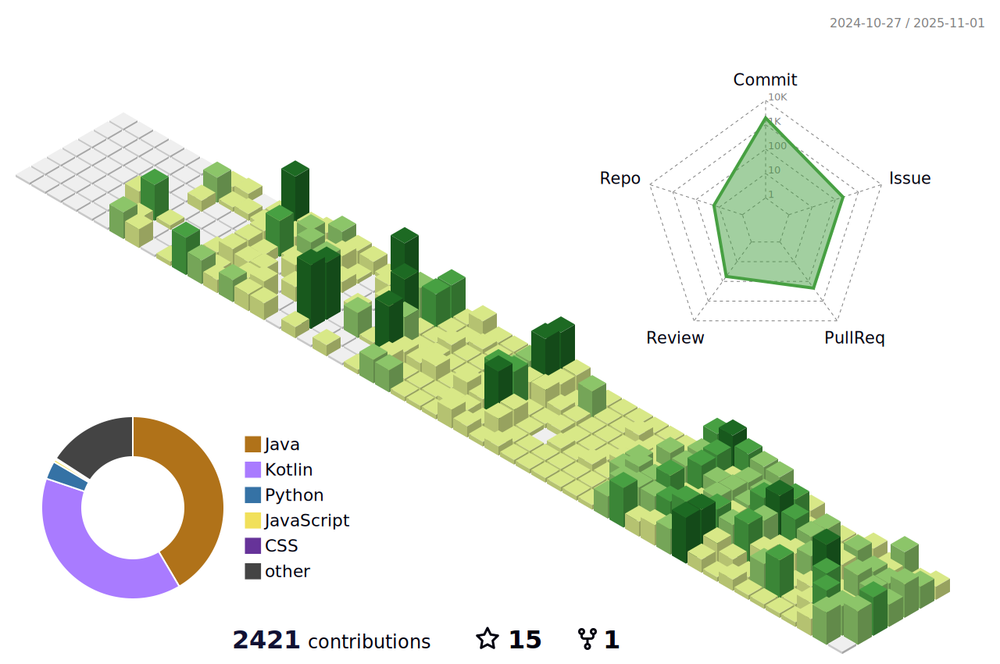

  
  
  <h1>✨What I've been learning</h1>
  

    <h4>Frontend</h4>
      
  

  

    <h4>Backend</h4>
      
  

  

    <h4>Tools</h4>
    
  

  <a href="https://www.gitanimals.org/en_US?utm_medium=image&utm_source=sehyeo&utm_content=farm">
    
  </a>
    

